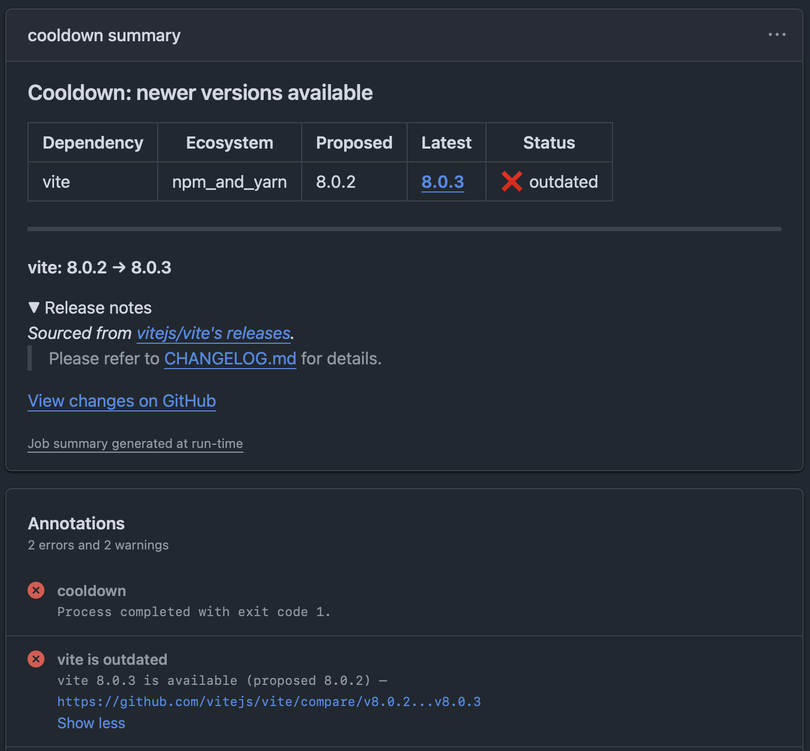

# Cooldown

A CI check that verifies Dependabot PRs propose the actual latest version of each dependency.

## The problem

Dependabot's built-in cooldown delays PR creation for a configurable number of days after a release. This prevents adopting brand-new releases, but it does not guarantee that the proposed version is still the latest when the cooldown expires.

Consider a 7-day cooldown:

- **Day 0:** v1.1.0 ships (broken).
- **Day 2:** v1.1.1 ships (fix).
- **Day 7:** Dependabot opens a PR for v1.1.0 -- the broken release.
- **Day 9:** Dependabot updates the PR to v1.1.1 -- the fix.

Between day 7 and day 9, the broken version sits in your PR queue. Cooldown catches this: the check fails on day 7 because v1.1.1 already exists, then passes on day 9 when Dependabot updates the PR.

## How it works

1. [`dependabot/fetch-metadata`](https://github.com/dependabot/fetch-metadata) extracts the dependency name, ecosystem, and proposed version from the PR.
2. Cooldown queries the appropriate package registry for all available versions.
3. If a newer stable version exists within the same major line, the check fails.

Cooldown supports three ecosystems:

| Ecosystem | Registry |
|---|---|
| GitHub Actions | GitHub Releases / Tags API |
| Go modules | proxy.golang.org |
| npm | registry.npmjs.org |

Unsupported ecosystems and registry errors pass silently (fail-open).

When a check fails, the job summary shows which dependencies are outdated, links to the newer release, and includes the release notes in a collapsed section:



## Usage

### With `go tool` (Go 1.24+)

Add the tool dependency to your repo:

```sh
go get github.com/jandubois/cooldown/cmd/cooldown
```

Then add a workflow:

```yaml
name: Dependabot Cooldown Check
on:
  pull_request:
    types: [opened, synchronize, reopened]

jobs:
  cooldown:
    runs-on: ubuntu-latest
    steps:
    - name: Checkout
      if: github.event.pull_request.user.login == 'dependabot[bot]'
      uses: actions/checkout@34e114876b0b11c390a56381ad16ebd13914f8d5 # v4.3.1

    - name: Set up Go
      if: github.event.pull_request.user.login == 'dependabot[bot]'
      uses: actions/setup-go@40f1582b2485089dde7abd97c1529aa768e1baff # v5.6.0
      with:
        go-version-file: go.mod

    - name: Fetch Dependabot metadata
      if: github.event.pull_request.user.login == 'dependabot[bot]'
      id: metadata
      uses: dependabot/fetch-metadata@21025c705c08248db411dc16f3619e6b5f9ea21a # v2.5.0
      with:
        github-token: ${{ secrets.GITHUB_TOKEN }}

    - name: Check versions are latest
      if: github.event.pull_request.user.login == 'dependabot[bot]'
      env:
        DEPENDENCIES_JSON: ${{ steps.metadata.outputs.updated-dependencies-json }}
        GITHUB_TOKEN: ${{ secrets.GITHUB_TOKEN }}
      run: go tool cooldown check
```

### As a GitHub Action

Use the action directly. It builds from source at the pinned ref — no pre-built binaries in the supply chain. The action sets up Go and runs `dependabot/fetch-metadata` automatically.

```yaml
name: Dependabot Cooldown Check
on:
  pull_request:
    types: [opened, synchronize, reopened]

jobs:
  cooldown:
    runs-on: ubuntu-latest
    steps:
    - name: Cooldown check
      if: github.event.pull_request.user.login == 'dependabot[bot]'
      uses: jandubois/cooldown@a6b75d6cf4b7845675a2ef0168e99528af4f4821 # v1.0.0
```

To control the `dependabot/fetch-metadata` version yourself, run it separately and pass the output:

```yaml
    - name: Fetch Dependabot metadata
      if: github.event.pull_request.user.login == 'dependabot[bot]'
      id: metadata
      uses: dependabot/fetch-metadata@21025c705c08248db411dc16f3619e6b5f9ea21a # v2.5.0
      with:
        github-token: ${{ secrets.GITHUB_TOKEN }}

    - name: Cooldown check
      if: github.event.pull_request.user.login == 'dependabot[bot]'
      uses: jandubois/cooldown@a6b75d6cf4b7845675a2ef0168e99528af4f4821 # v1.0.0
      with:
        dependencies-json: ${{ steps.metadata.outputs.updated-dependencies-json }}
        github-token: ${{ secrets.GITHUB_TOKEN }}
```

## Non-Dependabot PRs

Every step uses `if: github.event.pull_request.user.login == 'dependabot[bot]'`. Non-Dependabot PRs skip all steps and the job succeeds, so the check works as a required status check without blocking other PRs.

## License

Apache 2.0. See [LICENSE](LICENSE).
